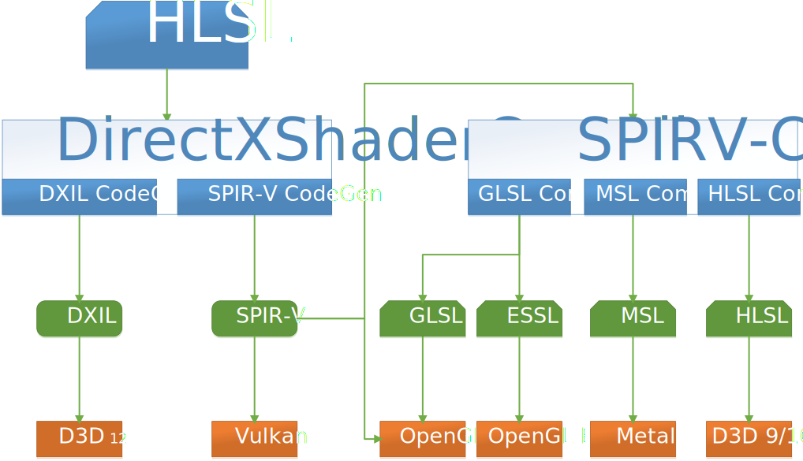

# ShaderConductor

ShaderConductor is a tool designed for cross-compiling HLSL to other shading languages.

## Features

* Converts HLSL to readable, usable and efficient GLSL
* Converts HLSL to readable, usable and efficient ESSL
* Converts HLSL to readable, usable and efficient Metal Shading Language (MSL)
* Converts HLSL to readable, usable and efficient old shader model HLSL
* Supports all stages of shaders, vertex, pixel, hull, domain, geometry, and compute.

Note that this project is still in an early stage, and it is under active development.

## Architecture

ShaderConductor is not a real compiler. Instead, it glues existing open source components to do the cross-compiling.
1. [DirectX Shader Compiler](https://github.com/Microsoft/DirectXShaderCompiler) to compile HLSL to [DXIL](https://github.com/Microsoft/DirectXShaderCompiler/blob/master/docs/DXIL.rst) or [SPIR-V](https://www.khronos.org/registry/spir-v/),
1. [SPIRV-Cross](https://github.com/KhronosGroup/SPIRV-Cross) to convert SPIR-V to target shading languages.



## Prerequisites

* [Git](http://git-scm.com/downloads).
* [Visual Studio 2017](https://www.visualstudio.com/downloads). Select the following workloads: Universal Windows Platform Development and Desktop Development with C++.
* [CMake](https://www.cmake.org/download/). Version 3.9 or up. It's highly recommended to choose "Add CMake to the system PATH for all users" during installation.
* [Python](https://www.python.org/downloads/). Version 2.7 or up. You need not change your PATH variable during installation.
* (Optional) [Windows Driver Kit](https://docs.microsoft.com/en-us/windows-hardware/drivers/download-the-wdk). DirectXShaderCompiler's tests are built using the TAEF framework. Unless you have the Windows Driver Kit installed, you should run the script at `External\DirectXShaderCompiler\utils\hct\hctgettaef.py` from your build environment before you start building to download and unzip it as an external dependency. You should only need to do this once.

## Building

ShaderConductor has been tested on Windows. Linux and macOS support are coming soon.

### The script way:

```
  BuildAll.py <BuildSystem> <Architecture> <Configuration>
```
where,
* \<BuildSystem\> can be ninja or vs2017. Default is vs2017.
* \<Architecture\> can be x64 or x86. Default is x64.
* \<Configuration\> can be Debug, Release, RelWithDebInfo, or MinSizeRel. Default is Release.
 
This script automatically grabs external dependencies to External folder, generates project file in Build/<BuildSystem>-<Platform>-<Configuration>, and builds it.

### The manual way:

```
  mkdir Build
  cd Build
  cmake -G "Visual Studio 15" -T v141,host=x64 -A x64 ../
  cmake --build .
```

After building, the output file ShaderConductor.dll can be located in \<YourCMakeTargetFolder\>/Bin/\<Configuration\>/. It depends on dxcompiler.dll in the same folder.

## License

ShaderConductor is distributed under the terms of MIT License. See [LICENSE](LICENSE) for details.

## Code of Conduct

This project has adopted the [Microsoft Open Source Code of Conduct](https://opensource.microsoft.com/codeofconduct/).
For more information see the [Code of Conduct FAQ](https://opensource.microsoft.com/codeofconduct/faq/) or
contact [opencode@microsoft.com](mailto:opencode@microsoft.com) with any additional questions or comments.
